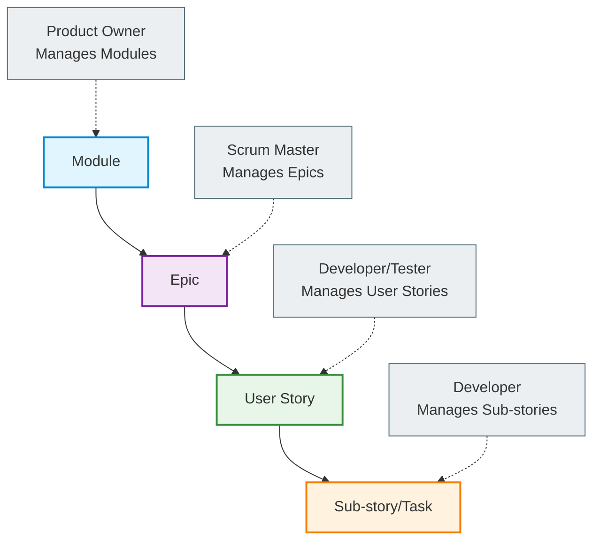
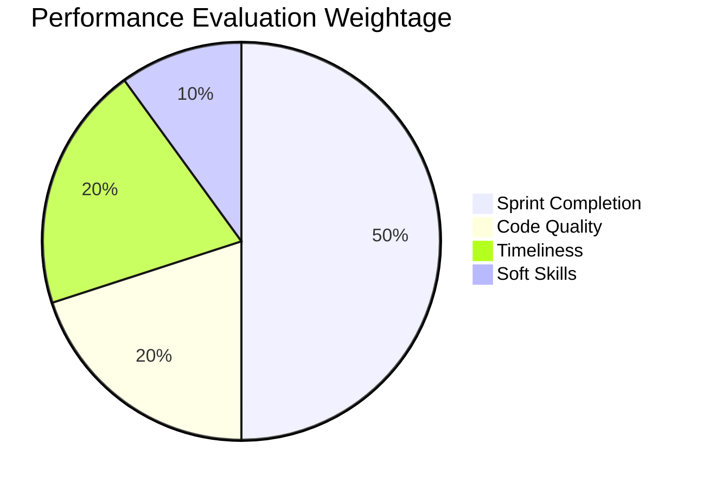
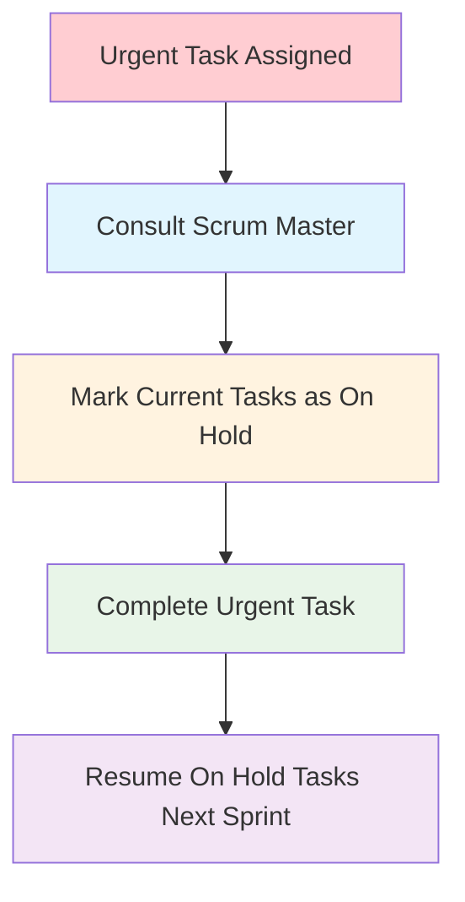

# 📘 Sprint Management & Workflow Guide

## Table of Contents

1. [Overview](https://claude.ai/chat/4967800f-ab29-40ed-a93b-54b8495d651b#overview)
2. [Work Item Hierarchy](https://claude.ai/chat/4967800f-ab29-40ed-a93b-54b8495d651b#work-item-hierarchy)
3. [Sprint Workflow](https://claude.ai/chat/4967800f-ab29-40ed-a93b-54b8495d651b#sprint-workflow)
4. [Task Status Management](https://claude.ai/chat/4967800f-ab29-40ed-a93b-54b8495d651b#task-status-management)
5. [Performance Evaluation](https://claude.ai/chat/4967800f-ab29-40ed-a93b-54b8495d651b#performance-evaluation)
6. [Estimation Guidelines](https://claude.ai/chat/4967800f-ab29-40ed-a93b-54b8495d651b#estimation-guidelines)
7. [Team Responsibilities](https://claude.ai/chat/4967800f-ab29-40ed-a93b-54b8495d651b#team-responsibilities)
8. [Quality Assurance](https://claude.ai/chat/4967800f-ab29-40ed-a93b-54b8495d651b#quality-assurance)

---

## 1. Overview

This document establishes the standardized processes and guidelines for sprint planning, execution, and delivery using **Plane** as our agile management platform. All team members must adhere to these practices to ensure accountability, transparency, and successful project delivery.

**Platform**: [Plane - 10xScale](https://plane.10xscale.ai/)

---

## 2. Work Item Hierarchy

### 2.1 Module

- **Owner**: Product Owner
- **Scope**: High-level business logic components
- **Duration**: Long-term strategic initiatives

### 2.2 Epic

- **Owner**: Scrum Master
- **Scope**: Large body of work spanning multiple sprints
- **Connection**: **Not directly connected to any sprint**
- **Purpose**: Organize related User Stories under business objectives
- **Estimation**: Not estimated at Epic level

### 2.3 User Story

- **Owner**: Developer/Tester (single assignee for accountability)
- **Duration**: Must be completed within one sprint
- **Requirements**:
    - Clear description and acceptance criteria
    - Start Date and End Date
    - Story point estimates
    - List of sub-stories
    - Single primary assignee

### 2.4 Sub-story/Task

- **Owner**: Developer
- **Purpose**: Break down User Stories into manageable work units
- **Requirements**:
    - Title
    - Estimate (story points/hours)
    - Clear scope definition

---

## 3. Sprint Workflow
![[sprint.jpg]]

### 3.1 Backlog Preparation

**Responsibility**: Scrum Master

- Create and prioritize all bugs and feature requests
- Ensure each item has:
    - Clear description
    - Acceptance criteria
    - Business priority
    - Dependencies identified

### 3.2 Sprint Planning

**Responsibility**: Scrum Master

- Move selected items from Backlog to To-Do
- Assign User Stories to developers
- Ensure minimum **20 story points** allocated per developer
- Validate story point estimates

### 3.3 Sprint Execution

**Timeline**: Standard sprint duration

- Developers move tasks through status workflow
- Daily standups and progress updates
- Continuous integration and testing

### 3.4 Sprint Review & Demo

**Deadline**: All tasks must be in Testing or Done state

- **Critical Rule**: Tasks in PR Review state are **NOT considered complete**
- Demo only completed and tested features
- Stakeholder feedback collection

---

## 4. Task Status Management

![[Pasted image 20250911135650.png]]

### 4.1 Status Definitions

| Status          | Owner             | Actions Required                                        | Performance Impact                        |
| --------------- | ----------------- | ------------------------------------------------------- | ----------------------------------------- |
| **Backlog**     | Scrum Master      | Item creation and prioritization                        | None                                      |
| **To-Do**       | Scrum Master      | Assignment to developers                                | None                                      |
| **In Progress** | Developer         | Add estimates, start/end dates, create sub-stories      | Yes - incomplete items impact performance |
| **PR Review**   | Developer         | Code review, testing on deployed platform               | None                                      |
| **Testing**     | Developer         | Quality validation, move to Done or back to In Progress | None                                      |
| **On Hold**     | Scrum Master Only | Urgent task management, no performance impact           | No                                        |
| **Done**        | Developer         | Task completion                                         | Positive impact                           |
| **Canceled**    | Scrum Master      | Task cancellation with proper documentation             | None                                      |

### 4.2 Critical Rules

#### In Progress Requirements

When moving to "In Progress", developers must:

- Set accurate start and end dates
- Provide story point estimates
- Create detailed sub-stories
- **Incomplete items in this status negatively impact performance evaluation**

#### On Hold Protocol

- **Only Scrum Master** can move items to On Hold
- Used exclusively for urgent tasks from leadership
- Developer must confirm with Scrum Master before requesting On Hold
- Tasks completed in following sprint with no performance penalty

#### Testing Guidelines

- No code changes allowed once moved to Testing
- Developer responsible for thorough validation
- Move to Done if passed, back to In Progress if issues found

---

## 5. Performance Evaluation

### 5.1 Performance Scoring Matrix

### 5.2 Performance Criteria

|Metric|Weight|Measurement|Impact|
|---|---|---|---|
|**Sprint Completion**|50%|Story points delivered vs. committed|High|
|**Code Quality**|20%|Code review feedback, bug rates|Medium|
|**Timeliness**|20%|Meeting deadlines, estimate accuracy|Medium|
|**Soft Skills**|10%|Communication, collaboration|Low|

### 5.3 Minimum Requirements

- **Minimum Allocation**: 20 story points per sprint per developer
- **Testing Deadline**: All new tasks submitted for testing by Friday of first sprint half
- **Bug Impact**: Reopened bugs due to developer error negatively impact evaluation

### 5.4 Penalty System

- Incomplete items in "In Progress" status
- Missing estimates or dates
- Protocol violations
- Late submissions without proper justification

### 5.5 Recognition System

- Consistent delivery above committed points
- High code quality with minimal bugs
- Proactive communication and collaboration
- Process improvement suggestions

---

## 6. Estimation Guidelines

### 6.1 Story Point Scale

|Points|Complexity|Time Estimate|Examples|
|---|---|---|---|
|**1**|Bug fix/Tiny change|30 mins - 1 hour|CSS fixes, text updates|
|**2**|Small feature update|Half day|Form field additions|
|**4**|New component/page/API|1 day|New React component|
|**8**|Complex feature/integration|2 days|Third-party API integration|
|**16**|Large feature|4-5 days (≈1 sprint)|Complete module functionality|
|**32**|Epic-level work|**Must be broken down**|Multi-sprint initiatives|

### 6.2 Estimation Rules

- **32-point tasks**: Must be broken into smaller User Stories
- **Multi-sprint work**: Requires proper planned dates documentation
- **No changes**: Estimates cannot be changed without Scrum Master approval
- **Developer responsibility**: All assigned work must have estimates

---

## 7. Team Responsibilities

### 7.1 Product Owner

- Define and prioritize business requirements
- Manage module-level planning
- Provide acceptance criteria and business context
- Participate in sprint reviews and demos

### 7.2 Scrum Master

- Manage backlog and sprint planning
- Facilitate team ceremonies
- Handle Epic-level work organization
- Approve estimate changes and On Hold requests
- Monitor team performance and process adherence

### 7.3 Developers

- Provide accurate estimates for all assigned work
- Maintain User Story and sub-story documentation
- Follow status workflow protocols
- Ensure code quality and testing standards
- Communicate blockers and dependencies promptly

### 7.4 Testers

- Collaborate on User Story definition
- Validate acceptance criteria
- Support quality assurance process
- Provide feedback on testability and requirements

---

## 8. Quality Assurance

### 8.1 Code Review Process

![[Pasted image 20250911135913.png]]

### 8.2 Definition of Done

- [ ] Code developed and unit tested locally
- [ ] Pull request created and reviewed
- [ ] Code merged to main branch
- [ ] Feature tested on deployed platform
- [ ] Acceptance criteria validated
- [ ] Documentation updated (if required)
- [ ] No blocking bugs identified

### 8.3 Bug Handling Protocol

- **New bugs**: Create in Backlog with proper priority
- **Reopened bugs**: Move back to In Progress with detailed reason
- **Developer-caused reopens**: Negative performance impact
- **Critical bugs**: Follow urgent task protocol

---

## 9. Emergency and Exception Handling

### 9.1 Urgent Task Management

### 9.2 Spillover Management

- **Definition**: Tasks not completed within sprint timeline OR submitted after Friday second half
- **Automatic Triggers**:
    - Tasks not moved to Testing before Friday second half cutoff
    - Tasks not completed within sprint timeline
- **Action**: Mark as Spillover, exclude from current sprint metrics
- **Completion**: Developer's own time, no sprint impact
- **Prevention**: Early submission strategy and better estimation

---

## 10. Tools and Platform Usage

### 10.1 Plane Platform Guidelines

- **Access**: [https://plane.10xscale.ai/](https://plane.10xscale.ai/)
- **Updates**: Real-time status updates required
- **Reporting**: Use built-in analytics for performance tracking
- **Integration**: Leverage GitHub integration for PR tracking

### 10.2 Communication Protocols

- **Daily Updates**: Status updates in daily standups
- **Blockers**: Immediate communication to Scrum Master
- **Changes**: Formal approval process for scope/estimate changes
- **Documentation**: Maintain clear audit trail in Plane

---

## 11. Continuous Improvement

### 11.1 Sprint Retrospectives

- Identify process improvements
- Address team challenges
- Celebrate successes and achievements
- Update this document as needed

### 11.2 Metrics and KPIs

- Sprint velocity tracking
- Bug leakage rates
- Cycle time analysis
- Team satisfaction scores

---

_This document is a living guide that will be updated based on team feedback and process improvements. All team members are expected to familiarize themselves with these guidelines and follow them consistently._

**Document Version**: 2.0  
**Last Updated**: September 2025  
**Review Cycle**: Monthly