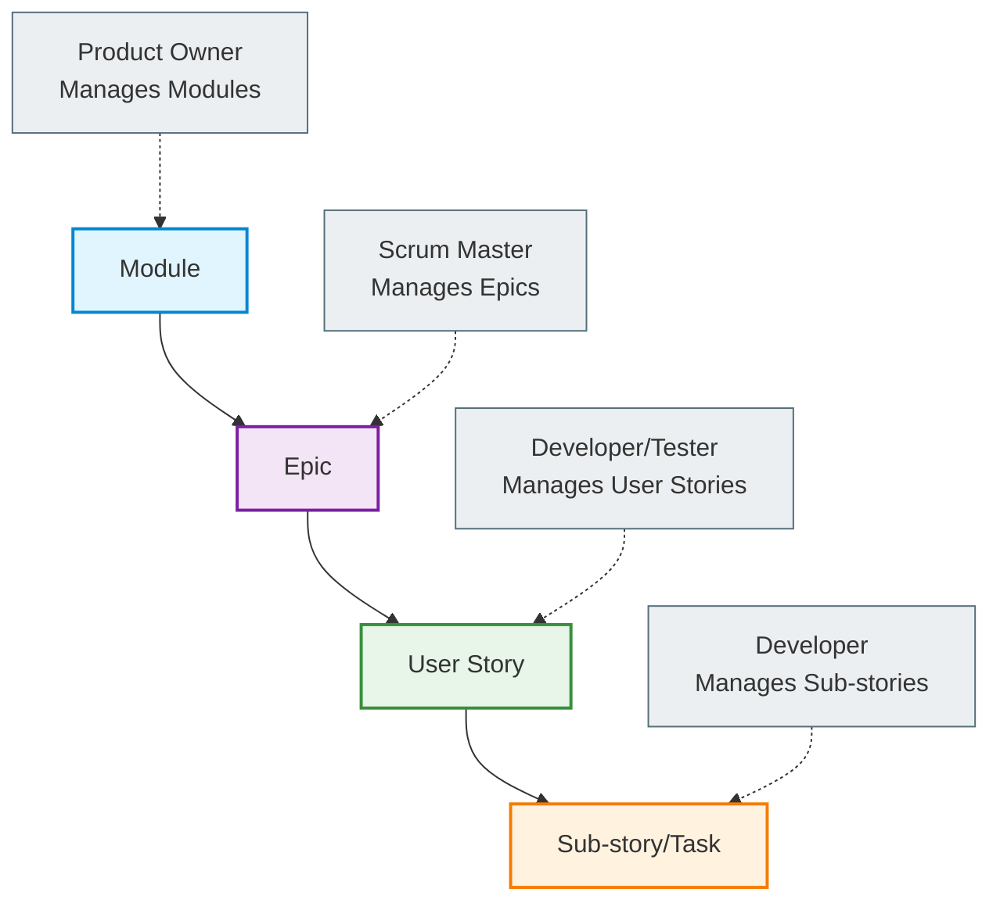
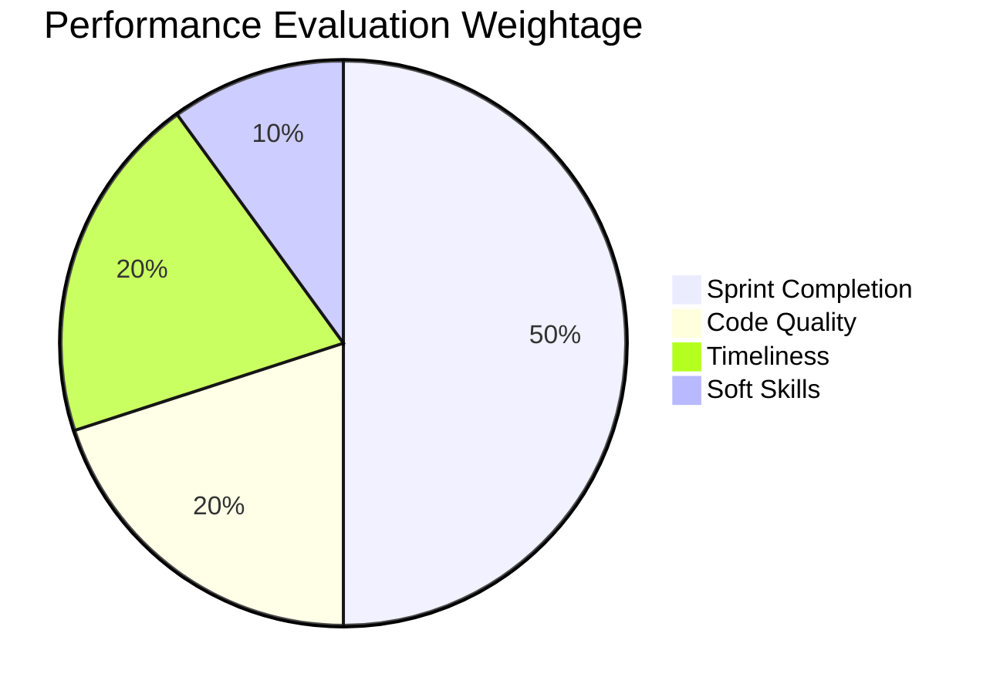
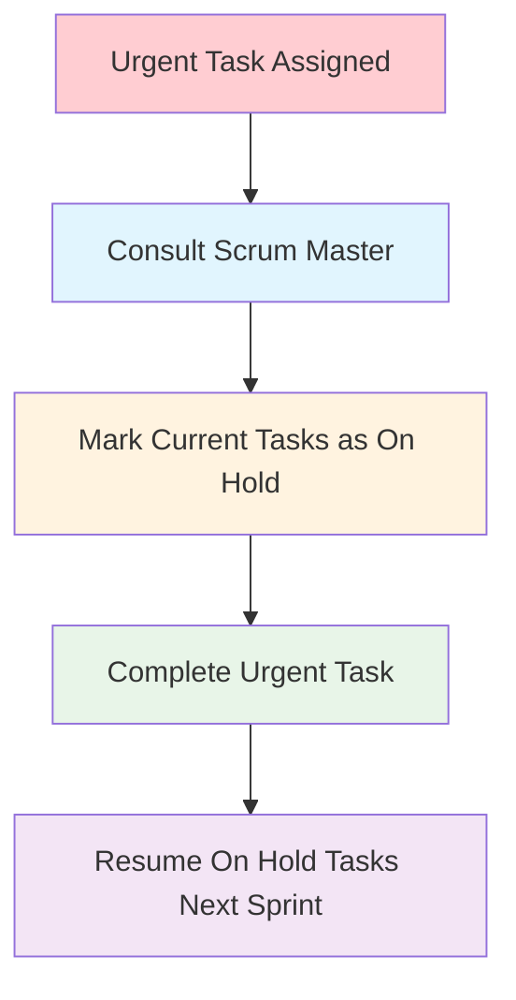

# 📘 Sprint Management & Workflow Guide

---

## **Document Information**

| **Field** | **Details** |
|-----------|-------------|
| **Document Title** | Sprint Management & Workflow Guide |
| **Document Version** | v1.0 |
| **Effective Date** | September 11, 2025 |
| **Last Reviewed Date** | September 11, 2025 |
| **Next Review Date** | December 1, 2025 |
| **Document Owner** | VP of Engineering |
| **Approved By** | Executive Team |
| **Classification** | Internal Use Only |
| **Last Updated By** | Shudipto Trafder |
| **Last Updated Date** | November 12, 2025 |

---

## **Executive Summary**

This Sprint Management & Workflow Guide provides a comprehensive framework for planning, executing, and delivering agile projects at Hire10x. It outlines standardized processes for sprint planning, work item management, team responsibilities, and performance evaluation. The guide ensures transparency, accountability, and continuous improvement across all agile teams, supporting successful project delivery and alignment with organizational goals.

---

## Table of Contents

1. [Overview](#overview)
2. [Work Item Hierarchy](#work-item-hierarchy)
3. [Sprint Workflow](#sprint-workflow)
4. [Task Status Management](#task-status-management)
5. [Performance Evaluation](#performance-evaluation)
6. [Estimation Guidelines](#estimation-guidelines)
7. [Team Responsibilities](#team-responsibilities)
8. [Quality Assurance](#quality-assurance)
9. [Emergency and Exception Handling](#emergency-and-exception-handling)
10. [Tools and Platform Usage](#tools-and-platform-usage)
11. [Continuous Improvement](#continuous-improvement)
12. [User Story Template](#user-story-template)
13. [Example User Stories](#example-user-stories)

---

## 1. Overview

This document establishes the standardized processes and guidelines for sprint planning, execution, and delivery using **Plane** as our agile management platform. All team members must adhere to these practices to ensure accountability, transparency, and successful project delivery.

**Platform**: [Plane - 10xScale](https://plane.10xscale.ai/)

---

## 2. Work Item Hierarchy



### 2.1 Module

- **Owner**: Product Owner
- **Scope**: High-level business logic components
- **Duration**: Long-term strategic initiatives

### 2.2 Epic

- **Owner**: Scrum Master
- **Scope**: Large body of work spanning multiple sprints
- **Connection**: **Not directly connected to any sprint**
- **Purpose**: Organize related User Stories under business objectives
- **Estimation**: Not estimated at Epic level
- **Date Management**: Start and End dates for tracking, but not for sprint planning
- **Completion**: Marked Done when all associated User Stories are completed

### 2.3 User Story

- **Owner**: Developer/Tester (single assignee for accountability)
- **Duration**: Must be completed within one sprint
- **Requirements**:
    - Clear description and acceptance criteria
    - Start Date and End Date
    - Story point estimates
    - List of sub-stories
    - Single primary assignee

### 2.4 Sub-story/Task

- **Owner**: Developer
- **Purpose**: Break down User Stories into manageable work units
- **Requirements**:
    - Title
    - Estimate (story points/hours)
    - Clear scope definition
- **Completion**: Marked Done when the specific task is completed, Developer responsible for status updates

---

## 3. Sprint Workflow

![[sprint.jpg]]

### 3.1 Backlog Preparation

**Responsibility**: Scrum Master

- Create and prioritize all bugs and feature requests
- Ensure each item has:
    - Clear description
    - Acceptance criteria
    - Business priority
    - Dependencies identified

### 3.2 Sprint Planning

**Responsibility**: Scrum Master

- Move selected items from Backlog to To-Do
- Assign User Stories to developers
- Ensure minimum **20 story points** allocated per developer
- Validate story point estimates

### 3.3 Sprint Execution

**Timeline**: Standard sprint duration

- Developers move tasks through status workflow
- Daily standups and progress updates
- Continuous integration and testing

### 3.4 Sprint Review & Demo

**Deadline**: All tasks must be in Testing or Done state

- **Critical Rule**: Tasks in PR Review state are **NOT considered complete**
- Demo only completed and tested features
- Stakeholder feedback collection

---

## 4. Task Status Management

![[Pasted image 20250911135650.png]]

### 4.1 Status Definitions

| Status          | Owner             | Actions Required                                            | Performance Impact                        |
| --------------- | ----------------- | ----------------------------------------------------------- | ----------------------------------------- |
| **Backlog**     | Scrum Master      | Item creation and prioritization                            | None                                      |
| **To-Do**       | Scrum Master      | Assignment to developers                                    | None                                      |
| **In Progress** | Developer         | Add estimates, start/end dates, create sub-stories          | Yes - incomplete items impact performance |
| **PR Review**   | Developer         | Code review, testing on deployed platform                   | None                                      |
| **Testing**     | Developer/Tester  | Quality validation, move to Done or back to In Progress     | None                                      |
| **On Hold**     | Scrum Master Only | Urgent task management, no performance impact for developer | No                                        |
| **Done**        | Tester            | Task completion on acceptance criteria                      | Positive impact                           |
| **Canceled**    | Scrum Master      | Task cancellation with proper documentation                 | None                                      |

Note: 
1. Tasks in **PR Review** are not considered complete for sprint metrics.
2. Tasks must be moved to **Testing** by Friday of the first half of the sprint to avoid being marked as Spillover.
3. **Sub-story** must be created for all User Stories, and estimates must be provided. Developers are responsible for maintaining accurate status updates, from inprogress to completion(done).
4. Developers must ensure all tasks are moved to **Testing** or **Done** by the end of the sprint. But they can not move tasks to Done directly, it must be done by Tester or Scrum Master after testing.


### 4.2 Critical Rules

#### In Progress Requirements

When moving to "In Progress", developers must:

- Set accurate start and end dates
- Provide story point estimates
- Create detailed sub-stories
- **Incomplete items in this status negatively impact performance evaluation**
- During Standup, that will be evaluated

#### PR Review Protocol
- Testing Coverage Report must be attached in PR description
- Code quality must meet team standards (linting, formatting, etc.)
- No direct merges to main branch without PR review
- All PRs must be linked to corresponding User Stories
- At least one peer review required before merging

#### On Hold Protocol

- **Only Scrum Master** can move items to On Hold
- Used exclusively for urgent tasks from leadership
- Developer must confirm with Scrum Master before requesting On Hold
- Tasks completed in following sprint with no performance penalty
- Developer not penalized for On Hold tasks

#### Testing Guidelines

- No code changes allowed once moved to Testing
- Developer responsible for thorough validation
- Move to Done if passed, back to In Progress if issues found
- Testing should be done based on acceptance criteria defined in User Story
- Reopened bugs due to developer error negatively impact performance evaluation
- All tasks must be in Testing or Done state by sprint end for successful completion

---

## 5. Performance Evaluation

### 5.1 Performance Scoring Matrix



### 5.2 Performance Criteria

|Metric|Weight|Measurement|Impact|
|---|---|---|---|
|**Sprint Completion**|50%|Story points delivered vs. committed|High|
|**Code Quality**|20%|Code review feedback, bug rates|Medium|
|**Timeliness**|20%|Meeting deadlines, estimate accuracy|Medium|
|**Soft Skills**|10%|Communication, collaboration|Low|

### 5.3 Minimum Requirements

- **Minimum Allocation**: 20 story points per sprint per developer
- **Testing Deadline**: All new tasks submitted for testing by Friday of first sprint half
- **Bug Impact**: Reopened bugs due to developer error negatively impact evaluation

### 5.4 Penalty System

- Incomplete items in "In Progress" status
- Missing estimates or dates
- Protocol violations
- Late submissions without proper justification

### 5.5 Recognition System

- Consistent delivery above committed points
- High code quality with minimal bugs
- Proactive communication and collaboration
- Process improvement suggestions

---

## 6. Estimation Guidelines

### 6.1 Story Point Scale

|Points|Complexity|Time Estimate|Examples|
|---|---|---|---|
|**1**|Bug fix/Tiny change|30 mins - 1 hour|CSS fixes, text updates|
|**2**|Small feature update|Half day (4 hours)|Form field additions|
|**4**|New component/page/API|1 day (8 hours)|New React component|
|**8**|Complex feature/integration|2 days (16 hours)|Third-party API integration|
|**16**|Large feature|4-5 days (≈1 sprint, 32 hours)|Complete module functionality|
|**32**|Epic-level work|**Must be broken down**|Multi-sprint initiatives|

### 6.2 Estimation Rules

- **32-point tasks**: Must be broken into smaller User Stories
- **Multi-sprint work**: Requires proper planned dates documentation
- **No changes**: Estimates cannot be changed without Scrum Master approval
- **Developer responsibility**: All assigned work must have estimates

---

## 7. Team Responsibilities

### 7.1 Product Owner

- Define and prioritize business requirements
- Manage module-level planning
- Provide acceptance criteria and business context
- Participate in sprint reviews and demos

### 7.2 Scrum Master

- Manage backlog and sprint planning
- Facilitate team ceremonies
- Handle Epic-level work organization
- Approve estimate changes and On Hold requests
- Monitor team performance and process adherence

### 7.3 Developers

- Provide accurate estimates for all assigned work
- Maintain User Story and sub-story documentation
- Follow status workflow protocols
- Ensure code quality and testing standards
- Communicate blockers and dependencies promptly

### 7.4 Testers

- Collaborate on User Story definition
- Validate acceptance criteria
- Support quality assurance process
- Provide feedback on testability and requirements

---

## 8. Quality Assurance

### 8.1 Code Review Process

![[Pasted image 20250911135913.png]]

### 8.2 Definition of Done

- [ ] Code developed and unit tested locally
- [ ] Pull request created, reviewed by peers
- [ ] Code merged to main branch
- [ ] Feature tested on deployed platform
- [ ] Acceptance criteria validated
- [ ] Documentation updated (if required)
- [ ] No blocking bugs identified

### 8.3 Bug Handling Protocol

- **New bugs**: Create in Backlog with proper priority
- **Reopened bugs**: Move back to In Progress with detailed reason
- **Developer-caused reopens**: Negative performance impact
- **Critical bugs**: Follow urgent task protocol

---

## 9. Emergency and Exception Handling

### 9.1 Urgent Task Management



### 9.2 Spillover Management

- **Definition**: Tasks not completed within sprint timeline OR submitted after Friday second half
- **Automatic Triggers**:
    - Tasks not moved to Testing before Friday second half cutoff
    - Tasks not completed within sprint timeline
- **Action**: Mark as Spillover, exclude from current sprint metrics
- **Completion**: Developer's own time, no sprint impact
- **Prevention**: Early submission strategy and better estimation

---

## 10. Tools and Platform Usage

### 10.1 Plane Platform Guidelines

- **Access**: [https://plane.10xscale.ai/](https://plane.10xscale.ai/)
- **Updates**: Real-time status updates required
- **Reporting**: Use built-in analytics for performance tracking
- **Integration**: Leverage GitHub integration for PR tracking

### 10.2 Communication Protocols

- **Daily Updates**: Status updates in daily standups
- **Blockers**: Immediate communication to Scrum Master
- **Changes**: Formal approval process for scope/estimate changes
- **Documentation**: Maintain clear audit trail in Plane

---

## 11. Continuous Improvement

### 11.1 Sprint Retrospectives

- Identify process improvements
- Address team challenges
- Celebrate successes and achievements
- Update this document as needed

### 11.2 Metrics and KPIs

- Sprint velocity tracking
- Bug leakage rates
- Cycle time analysis
- Team satisfaction scores

---
## 12. User Story Template
```
---

## User Story

**As a** [Application user role]
**I want** [feature/action]  
**So that** [benefit/value]

---

## Story Description
[Provide additional context about the user story, including background information, business justification, or any relevant details that help the team understand the why behind this story]

---

## Acceptance Criteria

**Scenario 1:**

Tips: Add these info the description
- **Given** [context]
- **When** [action]
- **Then** [outcome]

**Scenario 2:**

Tips: Add these info the description
- **Given** [context]
- **When** [action]
- **Then** [outcome]

**Additional Requirements:**

- [ ] [Specific condition]
- [ ] [Specific condition]
- [ ] [Error handling]

---

## Notes

- **Dependencies:** [If any]
  
```

---
## 13. Example User Stories

Below are a few example user stories to help teams write clear, testable, and well-scoped work items.

### Example 1 — Small Bug Fix (1 point)

**As a** User
**I want** the account display name on my profile page to show first and last name on the same line
**So that** my profile looks correct and consistent across browsers

**Story Description:**
- A cosmetic rendering issue was found in the profile page where long names can break into multiple lines in smaller viewports due to CSS flex and word-wrap rules. This story ensures a robust cross-browser fix with minimal layout changes.

**Acceptance Criteria:**
- Given I'm on the profile page, when the name is displayed, then it shows First Last with no line-breaks
- Unit tests to verify trimming and spacing are correct
- QA verifies display across Chrome, Safari, and Firefox

**Sub-tasks:**
- [ ] Fix CSS/markup
- [ ] Add unit test
- [ ] QA verification

**Notes / Dependencies:**
- Check for existing CSS variables and global styles that affect whitespace and overflow. No backend changes required.

### Example 2 — Small Feature (4 points)

**As a** Registered User
**I want** to receive an email notification when I request a password reset
**So that** I can recover my account securely

**Story Points:** 4

**Story Description:**
- When users request a password reset the backend currently logs the event but does not send an email — likely because of a missing integration. This story adds mailer integration and safeguards against leaking tokens.

**Acceptance Criteria:**
- When a user requests password reset, an email is sent with a reset link valid for 1 hour
- Email contains proper branding and instruction text
- Link leads to a password reset page and the token is validated
- Manual QA verifies sending behavior and edge-cases (invalid email, expired token)

**Sub-tasks:**
- [ ] Add backend endpoint for password reset generation
- [ ] Integrate with email provider to send templated email
- [ ] Add unit/integration tests to cover token expiry and validation
- [ ] QA verification

**Notes / Dependencies:**
- Depends on email provider credentials and existing auth-service token format. Ensure SES/Postmark credentials are present in staging.

### Example 3 — Integration (8 points)

**As a** Product User
**I want** to sync my events from my Google Calendar into the app
**So that** I can see my schedules in one place

**Story Points:** 8

**Story Description:**
- Product users want a one-click import of calendars. We will implement Google OAuth and a scheduled sync job in background to load events. The scope is the last 7 days of events on initial sync, with periodic incremental updates.


**Acceptance Criteria:**
- OAuth flow connects a Google account and stores tokens securely
- User can view the last 7 days of events in the app
- Sync job paginates results and handles rate-limits/retries
- Test and QA validate a successful sync and graceful error handling

**Sub-tasks:**
- [ ] Add OAuth connector and token storage
- [ ] Build background sync job with pagination and retry
- [ ] Add UI to show synced events and last-sync status
- [ ] Add integration test and QA validation

**Notes / Dependencies:**
- Requires Google Calendar API credentials, token storage, and background job scheduling infrastructure. Ensure data privacy policy is observed.

### Example 4 — Large Feature (16 points)

**As a** Security-Conscious User
**I want** Multi-Factor Authentication (MFA) on login
**So that** I can add an extra layer of security to my account

**Story Points:** 16

**Story Description:**
- Implement end-to-end Multi-Factor Authentication using TOTP as primary, SMS as optional. Focus on enroll, verify, and recovery flows. This is a security-critical feature and will require a design review and possibly changes in the authentication microservice.

**Acceptance Criteria:**
- Support Time-based One-Time Passwords (TOTP) and SMS (optional)
- Provide UI flow to enable/disable MFA and to recover when lost
- Enforce MFA on critical flows and optionally on all logins
- Add unit, integration, and E2E tests for the flow
- QA verifies TOTP codes and SMS delivery

**Sub-tasks:**
- [ ] Back-end implementation for TOTP and SMS
- [ ] Front-end flow for enrolling and verifying methods
- [ ] Add recovery and backup codes
- [ ] Security review and QA

**Notes / Dependencies:**
- Requires changes to auth service and user settings storage. SMS provider integration is optional but recommended for enterprise users. Coordinate with the security team for compliance checks.

---
**Document Control:**
- Classification: Internal Use Only
- Distribution: All Developers, Testers, POs, Scrum Masters
- Next Review Date: December 1, 2025
---

*This policy is effective immediately upon approval and supersedes all previous versions.*